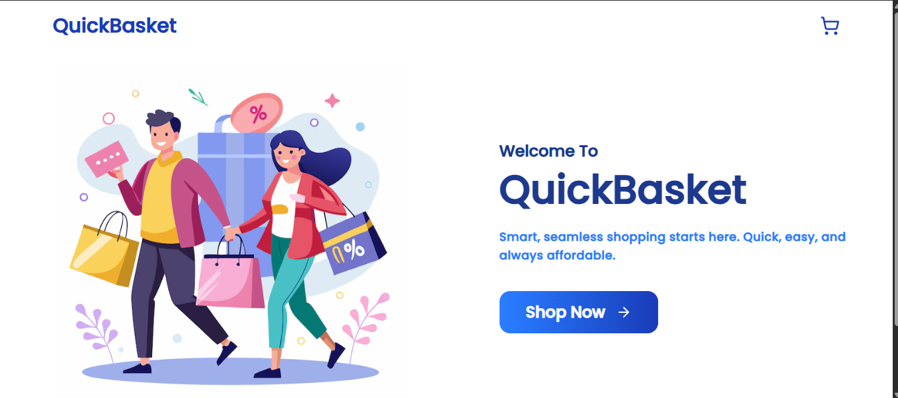

# 🛒 QuickBasket - Odin Shopping Cart Project

## 📸 Screenshots

---

QuickBasket is a modern and responsive shopping cart application built using **React**, **Tailwind CSS**, and **React Router**. This project is part of the Odin Project curriculum and focuses on integrating key frontend concepts like routing, state management, API handling, and user interface design.

---

## 🚀 Tech Stack

- **React** – Component-based architecture
- **Tailwind CSS** – Utility-first styling
- **React Router** – Page navigation
- **FakeStore API** – Product data fetching

---

## 🎯 Project Focus

> **Learning Goal:**  
Build a complete e-commerce cart flow with dynamic state updates, routing, and clean UI/UX practices, following Odin Project's Shopping Cart challenge.

---

## 🧩 Features

- ✅ **Clean & Responsive UI**
- 🏠 **Home Page** – Overview and intro
- 🛍️ **Product Page** – Display products from [FakeStore API](https://fakestoreapi.com)
- ➕ **Add to Cart** – Add products to your cart with selected quantity
- 🔄 **Real-time Quantity Update** – Adjust item quantities on the fly
- 🧮 **Subtotal Calculation** – Checkout page displays live totals
- 🛒 **Cart Page** – Review and manage your cart items
- ❌ **Remove Item** – Easily remove any product from the cart
- 💳 **Checkout Page** – Proceed to payment (UI only)
